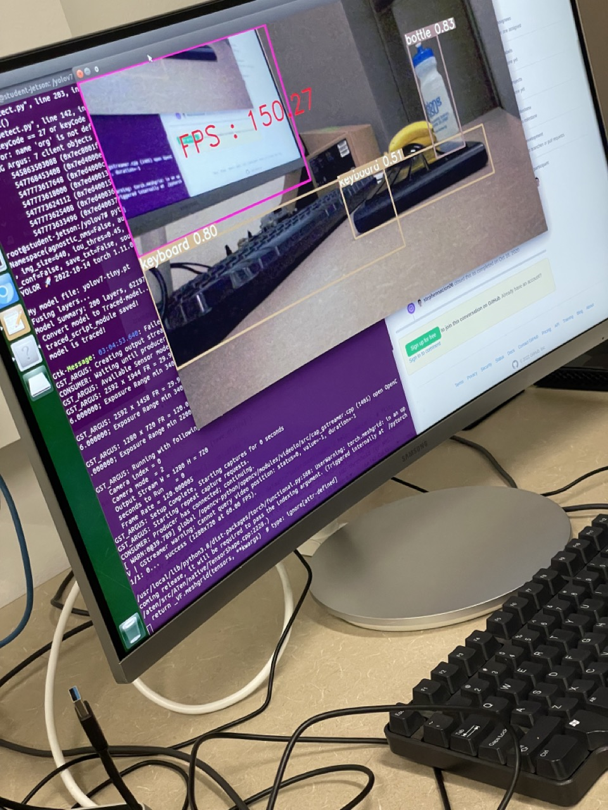

### Original [README.md](https://github.com/Ankur-singh/myyolov7/blob/main/README.md)

## Changes

1. Added `setup.sh` file to make 'nvidia' the default docker runtime. Refer [this commit](https://github.com/Ankur-singh/myyolov7/commit/dab4e45b2c419dc798ecfe27e9dc6b77e5780840)
2. Added `Dockerfile` that is based on `nvidia/l4t-base:r32.7.1`. It builds torch, torchvision and OpenCV from source for make the most out of NVIDIA Jetson. Refer [this commit](https://github.com/Ankur-singh/myyolov7/commit/f34921dcf3ec0860be38397ce8cb064c71f7ed5d)
3. Updated `LoadStreams` class (in `multi/moredatasets.py`) to use GSteamer for video capture. Refer [this commit](https://github.com/Ankur-singh/myyolov7/commit/5f1552c459ba3b5554cb3fea8b3e81d59d946822)
4. Updated `detectMulti.py` to show FPS details, and to gracefully release the VideoCapture object when using `--source 0`. Refer [this commit](https://github.com/Ankur-singh/myyolov7/commit/5f1552c459ba3b5554cb3fea8b3e81d59d946822)
5. Created a release with yolov7-tiny weights in three different formats:
    - PyTorch - https://github.com/Ankur-singh/myyolov7/releases/download/v0.1/yolov7-tiny.pt
    - ONNX - https://github.com/Ankur-singh/myyolov7/releases/download/v0.1/yolov7-tiny.onnx
    - TensorRT - https://github.com/Ankur-singh/myyolov7/releases/download/v0.1/yolov7-tiny.engine

    **Note:** [Refer this colab notebook](https://colab.research.google.com/drive/1KN-59oxazH25m5UTAYvC_jQjq1JYESUS?usp=sharing) to learn how to export & infer yolov7 model in different formats


## Benchmark : Model Scores
Here is a table summarising all the scores for all three model formats: 

| Model format | Precision | Recall | mAP@.5 | mAP@.5:.95 |
| --------- | --------- | --------- | --------- | --------- |
| Pytorch  | 0.637 | 0.594  | 0.651  | 0.441   |
| ONNX     | 0.74  | 0.54   | 0.635  | 0.437   | 
| TensorRT | 0.743 | 0.539  | 0.634  | 0.436   |

as you can see, pytorch model is slightly better than ONNX and TensorRT.

**Note:** All the models were tested on coco128 dataset. Also, testing was done on Google Colab (NOT on Jetson) 

To perform your own test, run the following:
1. Download the dataset

```bash
cd scripts
./get_coco128.sh
```

2. Download the model weights from [Release v0.1](https://github.com/Ankur-singh/myyolov7/releases/tag/v0.1). For example, we will download the Pytorch model weights

```bash
wget https://github.com/Ankur-singh/myyolov7/releases/download/v0.1/yolov7-tiny.pt
```

3. Run inference

```bash
python testMulti.py --weights yolov7-tiny.pt \  # any model format from the below table
                --data data/coco128.yaml \
                --batch-size 1 \
                --save-txt \
                --no-trace \
                --name torch
```

You can run inference on many different model formats. Here is the complete list all model formats supported by `testMulti.py`:

        #   PyTorch:              weights = *.pt
        #   TorchScript:                    *.torchscript
        #   ONNX Runtime:                   *.onnx
        #   ONNX OpenCV DNN:                *.onnx with --dnn
        #   OpenVINO:                       *.xml
        #   CoreML:                         *.mlmodel
        #   TensorRT:                       *.engine
        #   TensorFlow SavedModel:          *_saved_model
        #   TensorFlow GraphDef:            *.pb
        #   TensorFlow Lite:                *.tflite
        #   TensorFlow Edge TPU:            *_edgetpu.tflite

**Note**: You will have to seperately (and manually) install packages for the model format that you plan to perform inference on.

## Inference on Jetson

For deploying yolov7 model on Jetson, refer [this wiki](https://github.com/Ankur-singh/myyolov7/wiki/Jetson-Deployment)

Here is a sample image taken during inference



**Note:** I was ONLY able to run PyTorch model in Jetson.

## Challenges

- Jetson has only 28 GBs memory. Its very little memory to work with, most docker builds are failing because there is not enough memory. It would really help if there is more space to work with.
- Wheel file for `onnxruntime-gpu` is not available. So, I will have to build it from the source. I plan to follow the [this ONNX doc](https://onnxruntime.ai/docs/build/eps.html#nvidia-jetson-tx1tx2nanoxavier). I was not able to build it yet because there is no space in Jetson.

## Future Work

- Add support for ONNX model.
- Add support for TensorRT model.
- Try out [new tutorial](https://github.com/ultralytics/yolov5/issues/9627) from Ultralytics team on how to deploy yolov5 model on Jetson Nano 